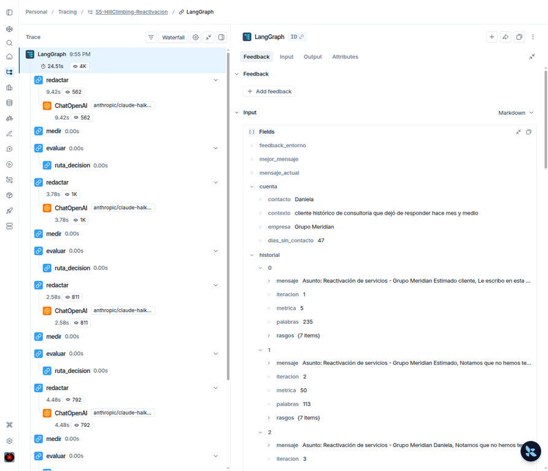
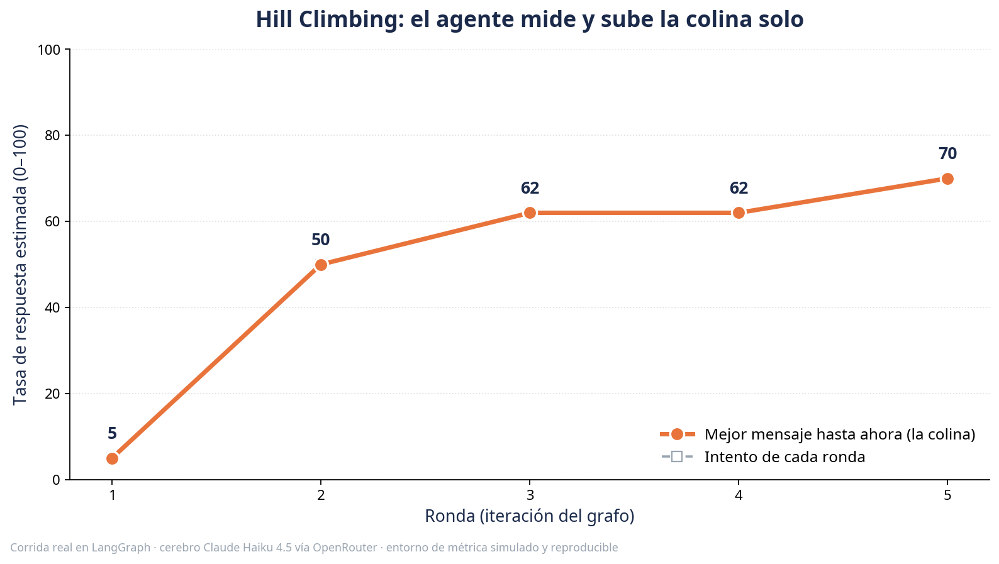

# S5 · Ejecuta un loop de Hill Climbing y míralo en LangSmith

**Claude para Productividad · Nivel 2 · León Ruiz / Collective Academy**

En esta actividad ejecutarás un agente que **redacta, mide, conserva el mejor resultado y decide si debe repetir**. Al final abrirás una traza creada en tu propia cuenta de LangSmith.

> **No necesitas programar, usar terminal ni configurar OpenRouter.** Solo necesitas una cuenta de LangSmith y una API key personal.

## Ejercicio oficial · 10–12 minutos

### Paso 1 · Crea tu llave

1. Abre [LangSmith Settings](https://smith.langchain.com/settings) e inicia sesión.
2. Entra a **API Keys**.
3. Presiona **Create API Key**.
4. Elige una llave personal, créala y cópiala. LangSmith solo muestra el valor una vez.[1]

No compartas esa llave en el chat, en el repositorio ni con otra persona.

### Paso 2 · Abre el ejercicio

### Paso 3 · Ejecuta todo

1. En Colab, abre **Entorno de ejecución → Ejecutar todas**.
2. Cuando aparezca `Pega tu API key de LangSmith`, pega tu llave y presiona Enter. El texto permanece oculto.
3. Espera a que aparezca **TU TRAZA ESTÁ LISTA**.
4. Abre el enlace que imprime el notebook.

Eso es todo. El notebook instala lo necesario, descarga el ejercicio, ejecuta cinco vueltas del grafo y genera el enlace a la traza.

## Qué debes encontrar

Dentro de LangSmith verás repetirse este ciclo:

> **redactar → medir → evaluar → decidir → repetir**

La corrida produce la progresión:

> **5 → 50 → 62 → 62 → 70**

La cuarta ronda no supera el récord de 62 y se descarta. Esto no es un fallo. Es evidencia de que el sistema puede probar una alternativa sin reemplazar un resultado mejor.

## La aclaración importante: LangSmith observa, no ejecuta

**LangSmith no es el motor que corre este ejercicio.** Google Colab ejecuta el código de LangGraph y LangSmith recibe la traza para que puedas inspeccionarla. LangSmith Studio sí puede conectarse a una aplicación desplegada o a un servidor local, pero esa ruta exige una configuración técnica adicional que no aporta valor para esta actividad básica/intermedia.[2]

| Componente | Función en esta actividad |
|---|---|
| **Google Colab** | Ejecuta el notebook sin instalar nada en tu computadora. |
| **LangGraph** | Mantiene el estado y controla el ciclo. |
| **Evaluador** | Aplica la misma rúbrica y calcula el puntaje. |
| **LangSmith** | Registra los nodos, entradas, salidas y tiempos de la corrida. |
| **Claude** | Produjo previamente los cinco borradores ficticios que esta ruta reproduce. |

## Qué es real y qué está preparado

**Son nuevos y reales:** la ejecución del grafo, las cinco decisiones, los puntajes recalculados y la traza que aparecerá en tu cuenta.

**Está preparado:** los cinco borradores. Provienen de una corrida previa de Claude para que toda la clase obtenga el mismo resultado sin necesitar una segunda API key.

**Es simulado:** el puntaje llamado “tasa de respuesta”. Es una rúbrica didáctica, no una predicción del comportamiento de un cliente. La actividad no envía correos ni modifica sistemas externos.

## Tu misión dentro de LangSmith

Abre tu traza y encuentra estas cuatro evidencias:

1. El patrón de nodos se repite cinco veces.
2. La métrica sube de 5 a 62 durante las primeras tres rondas.
3. La cuarta ronda obtiene 62 y no reemplaza el mejor resultado.
4. La quinta ronda alcanza 70 y se convierte en el mensaje ganador.

Después responde:

> Si la métrica premiara algo equivocado, ¿qué optimizaría el agente?

## Para quien quiera profundizar

La [guía técnica](GUIA_TECNICA.md) explica dónde vive cada pieza y cómo ejecutar una corrida nueva con Claude mediante OpenRouter. La [actividad de transferencia](ACTIVIDAD.md) ayuda a diseñar una “colina” para otro proceso. La [guía del facilitador](GUIA_FACILITADOR.md) contiene el guion de clase, manejo de preguntas y plan B.

## Mapa del repositorio

| Ruta | Contenido |
|---|---|
| `EJECUTA_S5_EN_LANGSMITH.ipynb` | Ruta oficial: abre en Colab, pega una llave y recibe el enlace a la traza. |
| `demo_hill_climbing.py` | Código del grafo, la rúbrica y los dos modos de ejecución. |
| `resultados/corrida-referencia.json` | Los cinco borradores ficticios de la corrida original. |
| `GUIA_TECNICA.md` | Ruta local y extensión avanzada con Claude. |
| `GUIA_FACILITADOR.md` | Guion preciso para conducir el ejercicio. |
| `ACTIVIDAD.md` | Plantilla sin código para transferir el patrón a otro proceso. |
| `AUDITORIA_PUBLICACION.md` | Controles técnicos, pedagógicos y de seguridad. |

## Regla de seguridad

Cada alumno utiliza su propia llave. El campo del notebook oculta el texto, no lo guarda en el archivo y lo retira de memoria al terminar. Aun así, una llave debe tratarse como contraseña y revocarse si se comparte accidentalmente.

## Idea para llevarte

> Un prompt produce una respuesta. Un loop de Hill Climbing produce intentos, los compara con una métrica explícita y conserva evidencia de por qué eligió uno.

Esto no significa que el modelo adquiera aprendizaje permanente. Significa que el sistema **optimiza dentro de una corrida** contra reglas diseñadas por una persona.

## Referencias

[1]: https://docs.langchain.com/langsmith/create-account-api-key "Create an account and API key · LangSmith Docs"
[2]: https://docs.langchain.com/langsmith/quick-start-studio "Get started with LangSmith Studio"
