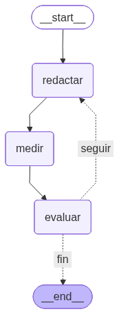

# S5 · Hill Climbing con LangGraph y LangSmith

**Claude para Productividad · Nivel 2 · León Ruiz / Collective Academy**

Este repositorio contiene la demostración de la Sesión 5: un agente que no acepta su primer borrador. El sistema **redacta, mide, conserva el mejor resultado y decide si debe repetir**. La ejecución se orquesta con LangGraph; Claude genera los borradores; LangSmith permite observar la traza completa.

> **Empieza aquí:** recorre esta página de arriba hacia abajo. La corrida de referencia se puede reproducir sin claves. El modo en vivo es opcional.

## Qué ocurrió en el ejercicio

El caso usa una cuenta ficticia llamada **Grupo Meridian**. El objetivo es mejorar un correo de reactivación. Cada versión recibe una puntuación didáctica de 0 a 100. La regla es simple: si una versión supera el mejor puntaje previo, se conserva; si no, se descarta.

La corrida registrada produjo esta secuencia:

> **5 → 50 → 62 → 62 → 70**

La cuarta ronda no mejoró. Eso no es un error: demuestra que el agente puede probar una alternativa sin reemplazar un resultado mejor.

## La arquitectura

| Componente | Función en el ejercicio |
|---|---|
| **LangChain** | Configura la conversación con Claude y realiza cada llamada al modelo. |
| **LangGraph** | Mantiene el estado y ejecuta el ciclo `redactar → medir → evaluar → decidir`. |
| **Claude** | Produce el primer borrador y las versiones siguientes. |
| **Evaluador determinista** | Aplica siempre la misma rúbrica y calcula el puntaje. |
| **LangSmith** | Registra la ejecución para inspeccionar entradas, salidas, latencia y orden de los pasos. |

LangGraph modela procesos con estado, nodos y rutas condicionales. En este ejercicio, una ruta condicional regresa de `evaluar` a `redactar` mientras no se cumpla una condición de paro.[1]

## Qué es real y qué es simulado

La distinción es importante. **El grafo, las llamadas a Claude y la traza de LangSmith son reales.** La “tasa de respuesta” es una **métrica didáctica simulada**. Premia brevedad, personalización, una pregunta directa, valor concreto, una cifra y una llamada a la acción de baja fricción. Penaliza clichés.

La demo no envía correos ni se conecta con clientes. Todo termina en un borrador revisable. El puntaje permite estudiar el loop; no predice el comportamiento real de una persona.

## La evidencia en LangSmith

La siguiente captura muestra una corrida real. A la izquierda se repite el patrón `redactar`, `medir`, `evaluar` y `ruta_decision`. Las llamadas `ChatOpenAI` son el adaptador compatible con OpenAI que se usó para invocar a Claude mediante el endpoint de OpenRouter; no indican que el modelo sea de OpenAI.[4]

LangSmith puede recibir automáticamente las trazas de aplicaciones construidas con LangChain y LangGraph. `LANGSMITH_PROJECT` determina el proyecto donde se agrupan.[2] [3]

## Ruta recomendada

1. Lee [`ACTIVIDAD.md`](ACTIVIDAD.md) y explica con tus palabras qué conserva el sistema después de cada ronda.
2. Abre [`resultados/corrida-referencia.json`](resultados/corrida-referencia.json) y compara los cinco borradores.
3. Ejecuta el modo de repetición siguiendo [`GUIA_TECNICA.md`](GUIA_TECNICA.md). No necesitas credenciales.
4. Si quieres crear una corrida nueva con Claude y verla en tu LangSmith, sigue la sección **Modo en vivo** de esa misma guía.

El facilitador puede usar [`GUIA_FACILITADOR.md`](GUIA_FACILITADOR.md) para conducir el walkthrough y responder preguntas frecuentes.

## Mapa del repositorio

| Ruta | Contenido |
|---|---|
| `demo_hill_climbing.py` | Código del grafo, la rúbrica, las condiciones de paro y ambos modos de ejecución. |
| `ACTIVIDAD.md` | Ejercicio guiado para diseñar una “colina” propia, sin requerir programación. |
| `GUIA_TECNICA.md` | Instalación, ejecución, trazas y explicación de dónde vive cada pieza. |
| `GUIA_FACILITADOR.md` | Guion de demostración, plan B y respuestas a preguntas difíciles. |
| `resultados/corrida-referencia.json` | Los cinco borradores y puntajes de la corrida publicada. |
| `assets/` | Grafo, curva y captura limpia de LangSmith. |
| `tests/` | Pruebas que confirman la secuencia de referencia y el comportamiento del grafo. |

## Regla de seguridad

Nunca publiques tu archivo `.env`, llaves de OpenRouter o LangSmith, datos reales de clientes ni contenido confidencial. El repositorio ignora `.env`, pero esa protección no sustituye una revisión antes de hacer commit.

## Idea para llevarte

> Un prompt produce una respuesta. Un loop de Hill Climbing produce intentos, los compara con una métrica explícita y conserva evidencia de por qué eligió uno.

No significa que el agente “aprenda” permanentemente ni que la métrica sea verdadera. Significa que **optimiza dentro de una corrida** contra las reglas que una persona diseñó.

## Referencias

[1]: https://docs.langchain.com/oss/python/langgraph/quickstart "LangGraph Python quickstart"
[2]: https://docs.langchain.com/langsmith/observability-quickstart "LangSmith observability quickstart"
[3]: https://docs.langchain.com/langsmith/log-traces-to-project "Log traces to a specific LangSmith project"
[4]: https://openrouter.ai/docs/quickstart "OpenRouter quickstart"
